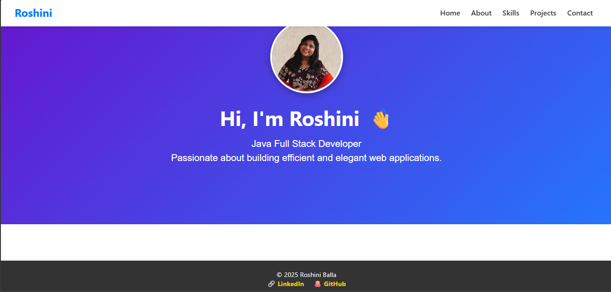

# 🌐 My Portfolio Website

Welcome to my personal **portfolio website** built with **Angular**!  
This site showcases about me, my skills, projects as a developer.

---

## 🚀 Features

- 🧑‍💼 About Me Section  
- 📚 Project Showcase  
- 📞 Contact Form  
- 🖥️ Fully Responsive Design  
- ⚡ Fast and Optimized Performance

---

## 🛠️ Tech Stack

- **Frontend**: Angular, TypeScript, HTML5, CSS3
- **Design**: Responsive CSS, Flexbox/Grid
- **Tools**: Visual Studio Code, Git, GitHub

---
## 🖼️ Home Page Screenshot


---

## 🚀 How to Run Locally

```bash
# Clone the repository
git clone https://github.com/Roshini-balla/MyPortFolio.git

```

# Navigate into the project folder
cd MyPortFolio

# Install dependencies
npm install

# Run the development server
ng serve
